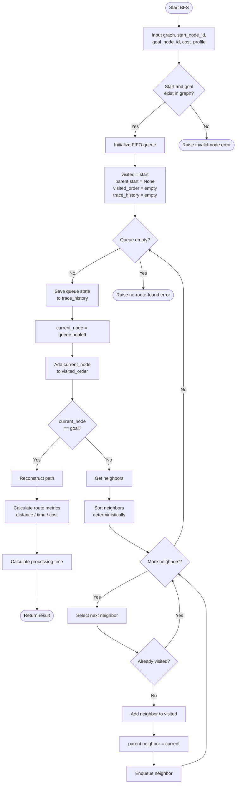

# Algo: Breadth-First Search (BFS)

- **Owner**: Ngọc
- **Branch**: `feature/bfs-search`
- **Source file**: `backend/app/algorithms/graph_search/bfs/bfs.py`
- **Test folder**: `backend/tests/unit/algorithms/graph_search/bfs/`
- **Docs folder**: `docs/algorithms/bfs/`

---

## 1. Overview

Breadth-First Search (BFS) được sử dụng trong RescueRoute để tìm đường từ `start_node_id` đến `goal_node_id` bằng cách duyệt đồ thị theo từng mức.

BFS sử dụng **FIFO Queue (First In First Out)**:

- Node được phát hiện trước sẽ được mở rộng trước.
- Mỗi node chỉ được đưa vào queue một lần nhờ tập `visited`.
- `parent` được sử dụng để truy vết lại đường đi sau khi tìm thấy đích.

### Tính chất quan trọng

BFS đảm bảo tìm được đường có **số cạnh / số hop nhỏ nhất** khi tất cả cạnh được xem là có cùng trọng số.

BFS **không sử dụng** khoảng cách, thời gian di chuyển, mức độ ùn tắc hay traffic cost để quyết định node nào được mở rộng tiếp theo.

Các thông số `total_distance`, `estimated_time` và `total_cost` chỉ được tính **sau khi BFS đã tìm được path** thông qua logic dùng chung của hệ thống.

---

## 2. Data Structures

### Queue

BFS sử dụng `deque` làm FIFO queue:

```python
queue = deque([start_node_id])
```

Node đầu queue được lấy bằng:

```python
current_node = queue.popleft()
```

### Visited Set

```python
visited = {start_node_id}
```

Node được đánh dấu `visited` ngay khi được thêm vào queue để tránh đưa cùng một node vào queue nhiều lần.

### Parent Table

```python
parent = {
    start_node_id: None
}
```

`parent` lưu node cha của mỗi node và được dùng để dựng lại final path.

### Visited Order

```python
visited_order = []
```

Lưu thứ tự các node được mở rộng, phục vụ kiểm thử, visualization và demo thuật toán.

### Trace History

```python
trace_history = SearchTraceHistory()
```

Lưu trạng thái queue trước mỗi bước mở rộng vào tập events để frontend có thể mô phỏng quá trình BFS.

Ví dụ:

```text
Step 1: [A]
Step 2: [B, C]
Step 3: [C, D]
```

---

## 3. Input Contract

BFS được thiết kế theo contract chung của graph-search algorithms:

```text
graph
start_node_id
goal_node_id
cost_profile
```

### Parameters

- `graph`: Graph abstraction của hệ thống hoặc adjacency dictionary dùng trong unit test.
- `start_node_id`: ID node bắt đầu.
- `goal_node_id`: ID node đích.
- `cost_profile`: cấu hình trọng số dùng để đánh giá route sau khi đã tìm được path.

> `cost_profile` không ảnh hưởng đến thứ tự duyệt của BFS.

---

## 4. Output Contract

BFS hiện chuẩn bị các field theo contract chung:

```text
path
visited_order
trace_history
total_distance
estimated_time
total_cost
explored_nodes
processing_time_ms
is_optimal
explanation_data
```

Ngoài ra BFS có thêm:

```text
hop_count
```

### Ý nghĩa

- `path`: danh sách node từ start đến goal.
- `visited_order`: thứ tự node được mở rộng.
- `trace_history`: chứa events mô tả trạng thái queue qua từng bước.
- `total_distance`: tổng khoảng cách của final path.
- `estimated_time`: tổng thời gian ước tính của final path.
- `total_cost`: tổng traffic cost của final path.
- `explored_nodes`: số node đã được mở rộng.
- `processing_time_ms`: thời gian xử lý BFS.
- `is_optimal`: trong implementation hiện tại mang nghĩa BFS tối ưu theo **minimum hops**.
- `explanation_data`: dữ liệu giải thích tính chất và giới hạn của BFS.
- `hop_count`: số cạnh trên final path.

> BFS tối ưu theo số hop, không đồng nghĩa với tối ưu theo distance, time hoặc traffic cost.

---

## 5. Route Metrics and Cost

BFS không tự viết công thức cost.

Sau khi tìm được:

```text
A -> B -> C -> D
```

BFS mới gọi:

```python
graph.calculate_path_metrics(
    path,
    cost_profile
)
```

để lấy:

```text
total_distance
estimated_time
total_cost
```

Luồng xử lý:

```text
BFS FIFO Search
      |
      v
 Final Path
      |
      v
calculate_path_metrics()
      |
      +--> total_distance
      +--> estimated_time
      +--> total_cost
```

Nếu đang chạy bằng adjacency dictionary đơn giản trong unit test, graph chưa có edge attributes nên các metric này có thể là `None`.

---

## 6. Pseudocode

```text
Algorithm: Breadth-First Search (BFS)

Input:
    graph
    start_node_id
    goal_node_id
    cost_profile

Output:
    path
    visited_order
    trace_history
    total_distance
    estimated_time
    total_cost
    explored_nodes
    processing_time_ms
    is_optimal
    explanation_data
    hop_count

BEGIN

    Convert start_node_id and goal_node_id to string

    IF start node does not exist OR goal node does not exist THEN
        RAISE invalid-node error
    END IF

    queue <- FIFO queue containing start_node_id
    visited <- {start_node_id}
    parent[start_node_id] <- NULL
    visited_order <- empty list
    trace_history <- init SearchTraceHistory

    START processing timer

    WHILE queue is not empty DO

        SAVE current queue into trace_history

        current_node <- DEQUEUE queue

        ADD current_node to visited_order

        IF current_node = goal_node_id THEN

            path <- reconstruct path using parent

            total_distance,
            estimated_time,
            total_cost
                <- calculate path metrics
                   using graph and cost_profile

            processing_time_ms <- elapsed processing time

            RETURN result containing:
                path
                visited_order
                trace_history
                total_distance
                estimated_time
                total_cost
                explored_nodes
                processing_time_ms
                is_optimal
                explanation_data
                hop_count

        END IF

        neighbors <- get neighbors of current_node

        SORT neighbors deterministically

        FOR each neighbor_node in neighbors DO

            IF neighbor_node is not in visited THEN

                ADD neighbor_node to visited

                parent[neighbor_node] <- current_node

                ENQUEUE neighbor_node

            END IF

        END FOR

    END WHILE

    RAISE no-route-found error

END
```

---

## 7. Reconstruct Path Pseudocode

```text
Algorithm: Reconstruct Path

Input:
    parent
    goal_node_id

Output:
    path

BEGIN

    path <- empty list
    current <- goal_node_id

    WHILE current is not NULL DO

        ADD current to path
        current <- parent[current]

    END WHILE

    REVERSE path

    RETURN path

END
```

---

## 8. Flowchart



---

## 9. Complexity

### Time Complexity

```text
O(V + E)
```

Trong đó:

- `V`: số node.
- `E`: số edge.

Mỗi node được xử lý tối đa một lần và mỗi edge được xem xét trong quá trình duyệt adjacency list.

### Space Complexity

```text
O(V)
```

Bộ nhớ chính dùng cho queue, visited, parent và visited_order.

`trace_history` được lưu để phục vụ visualization nên có thể làm tăng lượng bộ nhớ thực tế so với BFS tối giản.

---

## 10. Completeness

BFS là **complete** trên finite graph khi:

- graph hữu hạn,
- có cơ chế `visited`,
- và đường từ start đến goal tồn tại.

Nếu tồn tại route có thể đi tới, BFS cuối cùng sẽ tìm thấy route đó.

---

## 11. Optimality

BFS đảm bảo optimality theo:

```text
minimum number of edges / hops
```

khi tất cả cạnh được xem là có cùng trọng số.

BFS không đảm bảo:

```text
minimum physical distance
minimum estimated travel time
minimum congestion
minimum traffic cost
```

Trong RescueRoute, BFS đóng vai trò baseline để so sánh với các thuật toán có xét cost như UCS và A*.

---

## 12. Deterministic Neighbor Ordering

Neighbors được sắp xếp trước khi đưa vào queue:

```python
neighbors = sorted(neighbors)
```

Mục đích:

- kết quả test có thể tái lập,
- animation ổn định,
- dễ so sánh nhiều lần chạy,
- tránh route thay đổi chỉ vì thứ tự row trong CSV.

Nếu có nhiều minimum-hop paths, deterministic ordering giúp chọn cùng một path giữa các lần chạy.

---

## 13. Error Handling

### Invalid Node

Nếu start hoặc goal không tồn tại:

```text
raise ValueError
```

### No Route Found

Nếu queue rỗng trước khi tới goal:

```text
raise ValueError
```

Đây là xử lý tạm thời.

Sau khi common graph-search contract được merge, BFS nên sử dụng exception chung của project thay vì tự tạo exception riêng.

---

## 14. Common Contract Migration

BFS hiện được viết theo hướng **contract-ready**.

Không tạo `SearchResult` class riêng trong folder BFS.

Sau khi branch common contract được merge:

```text
feature/graph-search-contract
```

phần:

```python
return {
    ...
}
```

sẽ được thay bằng:

```python
return SearchResult(
    ...
)
```

và `ValueError` sẽ được thay bằng exception chung.

BFS core không cần thay đổi.

---

## 15. Unit Tests

Test chính nằm tại:

```text
backend/tests/unit/algorithms/graph_search/bfs/test_algorithm.py
```

Các trường hợp nên được kiểm tra:

```text
1. BFS finds minimum-hop path
2. start_node_id == goal_node_id
3. no path exists
4. directed edge is respected
5. node is not expanded twice
6. trace_history events are recorded correctly
```

Unit test chỉ kiểm tra correctness của BFS bằng graph nhỏ, không gọi API, database hoặc Internet.

Dataset thật được kiểm tra ở bước integration/system evaluation của project.

---

## 16. Example

Graph:

```text
        B ---- D
       /
A ----
       \
        C ---- E ---- D
```

Có hai đường:

```text
A -> B -> D
2 hops
```

và:

```text
A -> C -> E -> D
3 hops
```

BFS trả:

```text
A -> B -> D
```

vì có số cạnh ít hơn.

Ví dụ quá trình search:

```text
Initial frontier:
[A]

Expand A:
visited = [A]
frontier = [B, C]

Expand B:
visited = [A, B]
frontier = [C, D]

Expand C:
visited = [A, B, C]
frontier = [D, E]

Expand D:
goal found
```

---

## 17. Role of BFS in RescueRoute

```text
BFS
    -> minimum hops

DFS
    -> depth-first traversal, no optimality guarantee

UCS
    -> minimum accumulated traffic cost

A*
    -> accumulated traffic cost + heuristic
```

Các graph-search algorithms nên sử dụng cùng Graph abstraction và common SearchResult để có thể so sánh công bằng về:

- route quality,
- explored nodes,
- processing time,
- distance,
- estimated travel time,
- traffic cost.
