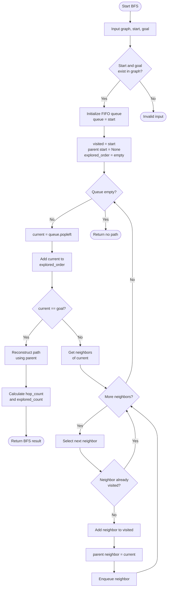

```mermaid
flowchart TD

    A([Start BFS])

    B[Input graph, start, goal]

    C{Start and goal<br/>exist in graph?}

    D[Initialize FIFO queue<br/>queue = start]

    E[visited = start<br/>parent start = None<br/>explored_order = empty]

    F{Queue empty?}

    G[current = queue.popleft]

    H[Add current to<br/>explored_order]

    I{current == goal?}

    J[Reconstruct path<br/>using parent]

    K[Calculate hop_count<br/>and explored_count]

    L([Return BFS result])

    M[Get neighbors<br/>of current]

    N{More neighbors?}

    O[Select next neighbor]

    P{Neighbor already<br/>visited?}

    Q[Add neighbor to visited]

    R[parent neighbor = current]

    S[Enqueue neighbor]

    T([Return no path])

    U([Invalid input])

    A --> B
    B --> C

    C -- No --> U
    C -- Yes --> D

    D --> E
    E --> F

    F -- Yes --> T
    F -- No --> G

    G --> H
    H --> I

    I -- Yes --> J
    J --> K
    K --> L

    I -- No --> M
    M --> N

    N -- No --> F
    N -- Yes --> O

    O --> P

    P -- Yes --> N

    P -- No --> Q
    Q --> R
    R --> S
    S --> N
```