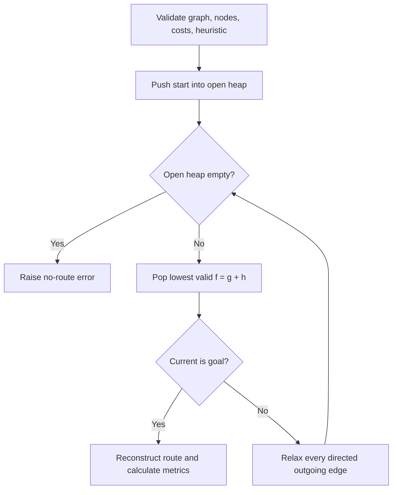

# A* Search design

## Objective

A* finds a minimum-cost directed route by expanding the node with the smallest
`f(n) = g(n) + h(n)`. `g` is obtained from the shared graph/cost callback; `h`
must use the same cost unit and estimate the remaining cost.

For geographic routing, a straight-line distance heuristic must be converted
with a proven lower bound on cost per metre. A raw distance is admissible only
when the route objective itself is distance. With non-negative edges and an
admissible heuristic, A* is complete on finite graphs and optimal. Consistency
additionally prevents node re-expansion.

## Pseudocode

```text
open <- priority queue containing start with priority h(start)
g[start] <- 0
parent[start] <- null

while open is not empty:
    record effective open frontier
    current <- pop minimum f, ignoring stale entries
    record current as expanded
    if current is goal:
        return reconstructed path and metrics

    for each directed neighbor of current:
        tentative <- g[current] + edge_cost(current, neighbor)
        if tentative improves g[neighbor]:
            g[neighbor] <- tentative
            parent[neighbor] <- current
            push neighbor with tentative + h(neighbor)

raise no-route error
```



## Verification

Unit tests cover weighted optimal paths, UCS equivalence, start equals goal,
directed/no-route behavior, high-cost edge avoidance, node reopening, invalid
costs/heuristics, deterministic frontier snapshots, and the result contract.
