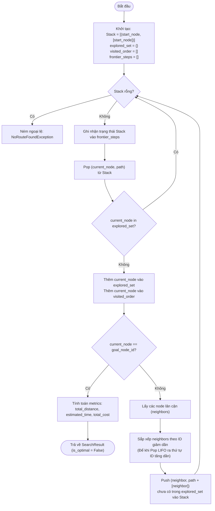

# Algo4: Depth-First Search (DFS)

- **Owner**: Kiên
- **Branch**: `feature/dfs-search`
- **Source location**: `backend/app/algorithms/graph_search/dfs/`
- **Flowchart file**: [flowchart.mmd](file:///d:/RescueRoute/docs/algorithms/dfs/flowchart.mmd)

---

## Algo4: Algorithms design

### 1. Overview & Context in RescueRoute
Depth-First Search (DFS) trong hệ thống tối ưu hóa lộ trình xe cấp cứu **RescueRoute** được sử dụng để tìm kiếm đường đi từ nút xuất phát (`start_node_id`) đến nút mục tiêu (`goal_node_id`) bằng cách duyệt toàn bộ đồ thị theo chiều sâu.

### 2. Data Structures & Graph Representation
- **Frontier / Open List**: Sử dụng cấu trúc dữ liệu **Stack (LIFO - Last In First Out)** để quản lý danh sách các node chờ khám phá.
- **Explored Set / Visited Table**: Tập hợp `set` lưu trữ các node đã duyệt qua nhằm phát hiện và tránh vòng lặp (cycle detection).
- **Path Tracking**: Lưu trữ đường đi dưới dạng cặp `(current_node, path)` trong Stack để truy vết lộ trình trực tiếp mà không cần bảng parent pointer riêng biệt.

### 3. Key Properties & Complexity
- **Tính đầy đủ (Completeness)**: Đảm bảo tìm thấy đường đi trên đồ thị hữu hạn nếu tồn tại đường đi và có cơ chế phát hiện chu trình (cycle detection).
- **Tính tối ưu (Optimality)**: `is_optimal = False`. DFS không đảm bảo đường đi tìm được là ngắn nhất hay có chi phí thấp nhất do bản chất thăm dò hết chiều sâu một nhánh trước.
- **Thứ tự duyệt nhất quán (Deterministic Neighbor Ordering)**: Các node lân cận (neighbors) được sắp xếp theo ID tăng dần (hoặc giảm dần trước khi push vào Stack LIFO) để đảm bảo thứ tự duyệt và kết quả kiểm thử hoàn toàn tái lập được (reproducible).
- **Độ phức tạp thời gian (Time Complexity)**: $\mathcal{O}(|V| + |E|)$ với $|V|$ là số đỉnh (nodes) và $|E|$ là số cạnh (edges).
- **Độ phức tạp không gian (Space Complexity)**: $\mathcal{O}(|V|)$ dùng lưu giữ các node trong Stack và tập explored set.

### 4. Input & Output Contract
- **Input**:
  - `graph`: Graph abstraction chứa danh sách Nodes và Edges.
  - `start_node_id` (`str`): ID nút xuất phát.
  - `goal_node_id` (`str`): ID nút đích.
  - `cost_profile`: Profile trọng số ($\alpha, \beta, \gamma$) dùng tính khoảng cách, thời gian và chi phí tuyến đường.
- **Output (`SearchResult`)**:
  - `path`: `list[str]` - Danh sách node ID theo thứ tự từ start đến goal.
  - `visited_order`: `list[str]` - Thứ tự mở rộng các node để frontend mô phỏng.
  - `frontier_steps`: `list[list[str]]` - Lịch sử trạng thái của Stack ở từng bước duyệt.
  - `total_distance`: `float` - Tổng khoảng cách lộ trình (mét).
  - `estimated_time`: `float` - Thời gian di chuyển ước tính (giây).
  - `total_cost`: `float` - Tổng chi phí theo Cost Function chung của dự án.
  - `explored_nodes`: `int` - Số lượng node đã khám phá.
  - `processing_time_ms`: `float` - Thời gian tính toán thuật toán (ms).
  - `is_optimal`: `bool` (`False`).
  - `explanation`: `str` - Giải thích kết quả tìm kiếm tuyến đường.

---

## Algo4: Pseudo code

```python
def solve_dfs(graph, start_node_id, goal_node_id, cost_profile) -> SearchResult:
    # 1. Initialize Stack with tuple (current_node, path_to_node)
    stack = [(start_node_id, [start_node_id])]
    visited_order = []
    frontier_steps = []
    explored_set = set()
    
    # 2. Main Search Loop
    while stack is not None and len(stack) > 0:
        # Record frontier state for animation
        frontier_steps.append([node for node, _ in stack])
        
        current_node, path = stack.pop()
        
        if current_node in explored_set:
            continue
            
        explored_set.add(current_node)
        visited_order.append(current_node)
        
        # Goal Test
        if current_node == goal_node_id:
            total_distance, estimated_time, total_cost = calculate_metrics(path, graph, cost_profile)
            return SearchResult(
                path=path,
                visited_order=visited_order,
                frontier_steps=frontier_steps,
                total_distance=total_distance,
                estimated_time=estimated_time,
                total_cost=total_cost,
                explored_nodes=len(explored_set),
                is_optimal=False,
                explanation="DFS tìm thấy tuyến đường nhưng không đảm bảo đây là phương án tối ưu nhất."
            )
            
        # Get neighbors and sort deterministically (reverse sorted for LIFO stack popping order)
        neighbors = graph.get_neighbors(current_node)
        neighbors.sort(key=lambda edge: edge.v, reverse=True)
        
        for edge in neighbors:
            neighbor_node = edge.v
            if neighbor_node not in explored_set:
                stack.append((neighbor_node, path + [neighbor_node]))
                
    raise NoRouteFoundException("Không tìm thấy đường đi từ start đến goal.")
```

---

## Algo4: Flowchart

> File nguồn sơ đồ Mermaid tách riêng: [flowchart.mmd](file:///d:/RescueRoute/docs/algorithms/dfs/flowchart.mmd)



---

## Algo4: Complete Algorithms

```python
import time
from typing import Any, Dict, List, Set, Tuple


class NoRouteFoundException(Exception):
    """Ngoại lệ khi không tìm thấy lộ trình giữa start và goal."""
    pass


class SearchResult:
    """Kết quả trả về chuẩn của thuật toán tìm đường trong RescueRoute."""
    def __init__(
        self,
        path: List[str],
        visited_order: List[str],
        frontier_steps: List[List[str]],
        total_distance: float,
        estimated_time: float,
        total_cost: float,
        explored_nodes: int,
        processing_time_ms: float,
        is_optimal: bool,
        explanation: str
    ):
        self.path = path
        self.visited_order = visited_order
        self.frontier_steps = frontier_steps
        self.total_distance = total_distance
        self.estimated_time = estimated_time
        self.total_cost = total_cost
        self.explored_nodes = explored_nodes
        self.processing_time_ms = processing_time_ms
        self.is_optimal = is_optimal
        self.explanation = explanation


def solve_dfs(
    graph: Any,
    start_node_id: str,
    goal_node_id: str,
    cost_profile: Any = None
) -> SearchResult:
    """
    Thuật toán Depth-First Search (DFS) tìm đường trên đồ thị RescueRoute.
    
    Args:
        graph: Đồ thị chứa thông tin nút và cạnh.
        start_node_id: Mã ID nút xuất phát.
        goal_node_id: Mã ID nút đích.
        cost_profile: Profile trọng số tính toán chi phí tuyến đường.
        
    Returns:
        SearchResult chứa chi tiết tuyến đường và dữ liệu phục vụ mô phỏng UI.
    """
    start_time = time.perf_counter()
    
    # Kiểm tra nút đầu vào hợp lệ
    if not graph.has_node(start_node_id) or not graph.has_node(goal_node_id):
        raise NoRouteFoundException(f"Node start '{start_node_id}' hoặc goal '{goal_node_id}' không tồn tại trong đồ thị.")
        
    # Stack chứa các tuple: (current_node_id, path_so_far)
    stack: List[Tuple[str, List[str]]] = [(start_node_id, [start_node_id])]
    visited_order: List[str] = []
    frontier_steps: List[List[str]] = []
    explored_set: Set[str] = set()
    
    while stack:
        # Ghi nhận trạng thái Stack cho frontend mô phỏng (frontier animation)
        frontier_steps.append([node_id for node_id, _ in stack])
        
        current_node, path = stack.pop()
        
        if current_node in explored_set:
            continue
            
        explored_set.add(current_node)
        visited_order.append(current_node)
        
        # Kiểm tra điều kiện dừng (đã đạt mốc đích)
        if current_node == goal_node_id:
            end_time = time.perf_counter()
            processing_time_ms = (end_time - start_time) * 1000.0
            
            # Tính toán chỉ số tổng tuyến đường từ path
            total_distance, estimated_time, total_cost = graph.calculate_path_metrics(path, cost_profile)
            
            return SearchResult(
                path=path,
                visited_order=visited_order,
                frontier_steps=frontier_steps,
                total_distance=total_distance,
                estimated_time=estimated_time,
                total_cost=total_cost,
                explored_nodes=len(explored_set),
                processing_time_ms=processing_time_ms,
                is_optimal=False,
                explanation="DFS tìm thấy tuyến đường theo chiều sâu. Tuyến đường không đảm bảo tính tối ưu nhất."
            )
            
        # Lấy danh sách cạnh đi ra từ node hiện tại
        neighbors = graph.get_neighbors(current_node)
        
        # Sắp xếp các cạnh theo v ID giảm dần để khi POP ra từ Stack (LIFO) sẽ theo thứ tự tăng dần
        neighbors_sorted = sorted(neighbors, key=lambda edge: str(edge.v), reverse=True)
        
        for edge in neighbors_sorted:
            neighbor_id = str(edge.v)
            if neighbor_id not in explored_set:
                stack.append((neighbor_id, path + [neighbor_id]))
                
    end_time = time.perf_counter()
    raise NoRouteFoundException(f"Không tìm thấy đường đi từ '{start_node_id}' đến '{goal_node_id}'.")
```
