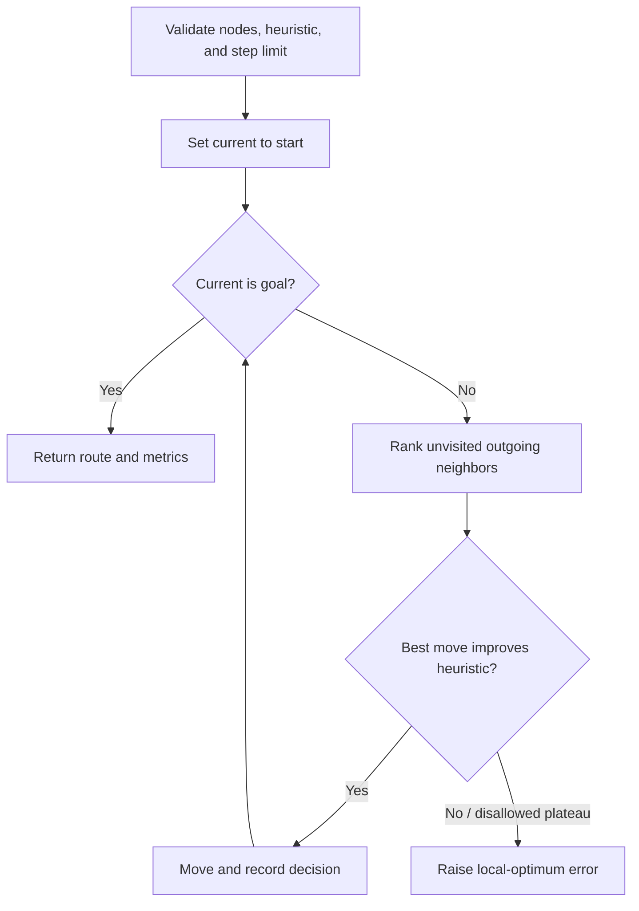

# Hill Climbing design

## Objective

This implementation constructs a directed route by repeatedly selecting the
unvisited neighbor with the smallest heuristic estimate to the goal. It is a
greedy local-search baseline: it can be fast and memory-light, but it is not
complete and does not guarantee a globally minimum-cost path.

Equal heuristic values use a stable node-ID tie-break. Sideways moves are off by
default and may be enabled explicitly; visited nodes are never selected again,
so a plateau cannot create an infinite cycle.

## Pseudocode

```text
current <- start
path <- [start]
visited <- {start}

until current is goal:
    candidates <- all unvisited directed neighbors
    rank candidates by (heuristic, stable node ID)
    record ranked candidates

    if no candidate exists:
        raise dead-end error
    next <- best candidate
    if next is not better and no permitted sideways move:
        raise local-optimum error

    append next to path and visited
    current <- next

return path, decision steps, and route metrics
```



## Verification

Unit tests cover successful routing, start equals goal, ranked candidates,
local optima, optional sideways moves, directed/dead-end behavior, deterministic
ties, step limits, invalid inputs, route metrics, and the result contract.
