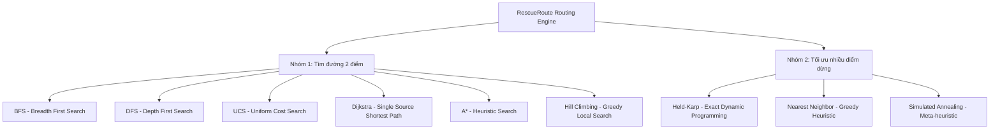
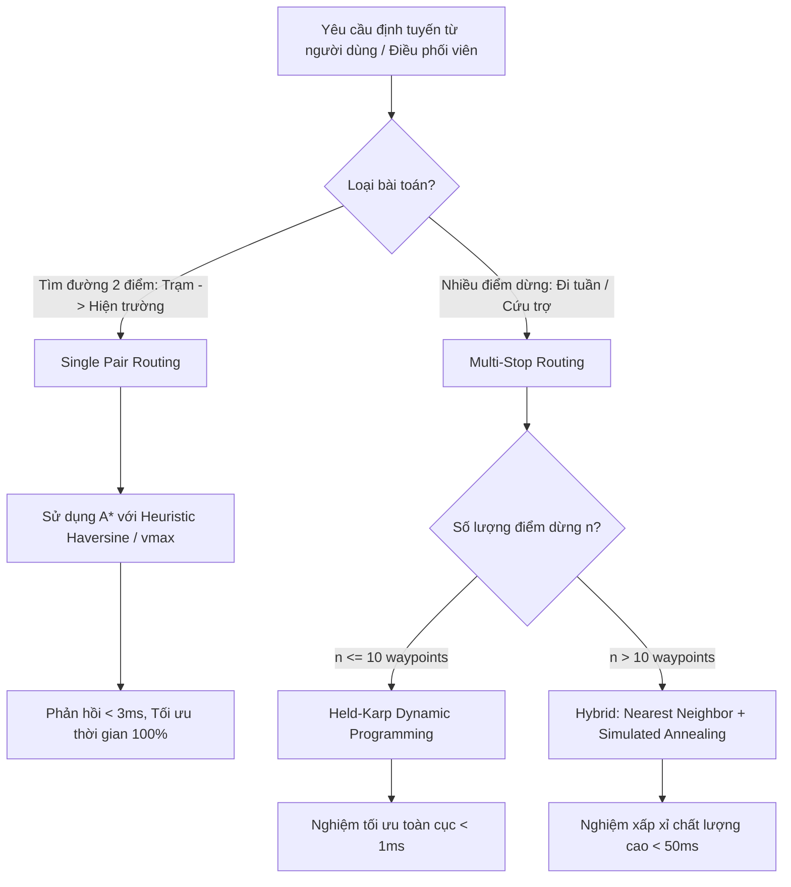

# Báo Cáo Thực Nghiệm & Benchmark Thuật Toán — RescueRoute

> **Tài liệu tham chiếu chuẩn cho đồ án**: Báo cáo đánh giá hiệu năng, bộ nhớ, tính tối ưu và tính hoàn chỉnh của các thuật toán tìm đường và tối ưu hóa lộ trình cứu hộ khẩn cấp trên mô hình đồ thị giao thông thực tế.
> 
> - **Mã nguồn thực nghiệm (Jupyter Notebook)**: [`scripts/benchmark_algorithms.ipynb`](../../scripts/benchmark_algorithms.ipynb)
> - **Script sinh biểu đồ tự động**: [`scripts/generate_benchmark_plots.py`](../../scripts/generate_benchmark_plots.py)
> - **Thư mục lưu trữ artifact & kết quả**: `artifacts/benchmarks/`

---

## 1. Tổng quan & Mục tiêu thực nghiệm

Trong hệ thống điều phối cứu hộ khẩn cấp **RescueRoute**, hiệu năng của các thuật toán định tuyến đóng vai trò then chốt:
1. **Tìm đường hai điểm (Point-to-Point Search)**: Cần phản hồi tức thời (< 50 ms) với đường đi có **thời gian di chuyển ngắn nhất**, hỗ trợ xe cứu thương/cứu hỏa di chuyển nhanh nhất từ trạm cứu hộ đến hiện trường sự cố.
2. **Tối ưu thứ tự nhiều điểm dừng (Multi-Stop Optimization / TSP Variant)**: Cần sắp xếp thứ tự đón/trả nạn nhân hoặc phân phối nhu yếu phẩm qua nhiều trạm cứu trợ sao cho tổng thời gian toàn bộ hành trình là nhỏ nhất.

Báo cáo này phân lập 2 bài toán thành 2 nhóm benchmark độc lập để đánh giá khách quan:



> [!IMPORTANT]
> Không so sánh trực tiếp thời gian thực thi giữa Nhóm 1 và Nhóm 2 vì không gian trạng thái, mục tiêu bài toán và contract dữ liệu đầu ra khác nhau hoàn toàn.

---

## 2. Phương pháp luận & Tiêu chí đo lường

Để đảm bảo tính khách quan, công bằng và khả năng tái lập (reproducibility) theo chuẩn nghiên cứu khoa học, quy trình thực nghiệm tuân thủ các nguyên tắc sau:

1. **Cùng điều kiện đầu vào**:
   - Tất cả thuật toán tìm đường chạy trên cùng một thể hiện đồ thị giao thông (Graph instance), cùng cặp `(start_node, goal_node)`, cùng hàm chi phí cạnh `estimated_time_s` (thời gian di chuyển ước tính tính bằng giây) và cùng thứ tự duyệt láng giềng.
   - Tất cả thuật toán nhiều điểm dừng chạy trên cùng một ma trận chi phí đôi một (Pairwise Cost Matrix) được tạo bằng thuật toán Dijkstra tối ưu và cùng cặp điểm xuất phát/kết thúc.
2. **Loại bỏ nhiễu bộ thu gom rác (Garbage Collector)**:
   - Trong quá trình đo thời gian (`TIME_REPEATS = 21`), module `gc` của Python được tạm vô hiệu hóa (`gc.disable()`) để tránh việc giải phóng bộ nhớ ngẫu nhiên làm biến dạng latency của một lượt chạy cụ thể.
3. **Phân lập đo lường bộ nhớ bằng `tracemalloc`**:
   - `tracemalloc` làm chậm tốc độ thực thi của Python VM do phải theo dõi từng bytecode cấp phát. Vì vậy, số liệu bộ nhớ được đo riêng biệt trong lượt đo bộ nhớ (`MEMORY_REPEATS = 7`) sau khi đã hoàn thành lượt đo thời gian.
4. **Cố định hạt giống ngẫu nhiên (Fixed Random Seed)**:
   - Giải thuật ngẫu nhiên (Simulated Annealing) nhận seed cố định (`RANDOM_SEED = 20260817`) để đảm bảo kết quả có tính tất định và có thể kiểm chứng lại.

### Bảng tiêu chí đo lường

| Tiêu chí | Đơn vị & Phương pháp đo | Ý nghĩa khoa học |
| :--- | :--- | :--- |
| **Thời gian thực thi (Latency)** | Median & 95th-percentile ($p95$) của Wall-clock time ($\text{ms}$), sau 3 lượt warm-up ($N=21$) | Median phản ánh độ trễ trung vị ổn định; $p95$ thể hiện trường hợp chậm bất thường (worst-case jitter). Đo bao quát toàn bộ hàm thuật toán bao gồm cả việc tạo snapshot trace history cho UI. |
| **Bộ nhớ đỉnh (Peak Heap)** | Median & Max của **Peak Python Heap** ($\text{MiB}$), đo bằng `tracemalloc` ($N=7$) | Đo lường dung lượng RAM thực sự mà thuật toán cấp phát cho frontier, visited set và trace events. Không tính bộ nhớ lưu trữ đồ thị nền đã nạp trước đó. |
| **Độ tối ưu (Optimality Gap)** | $\text{Gap}(\%) = \frac{\text{Cost}_{\text{algo}} - \text{Cost}_{\text{oracle}}}{\text{Cost}_{\text{oracle}}} \times 100\%$ | Đo lường khoảng cách phần trăm so với chi phí của nghiệm tối ưu toàn cục. **Dijkstra** làm Oracle cho Nhóm 1; **Held-Karp** làm Oracle cho Nhóm 2. |
| **Tính hoàn chỉnh (Completeness)** | Điều kiện lý thuyết & `completed_all_runs` ($\text{True}/\text{False}$) | Xác định thuật toán có bảo đảm luôn tìm ra đường đi nếu đường đi tồn tại hay không. Phân biệt rõ giữa việc "chạy thành công trên test case cụ thể" và "tính hoàn chỉnh về mặt toán học". |
| **Tính tất định (Determinism)** | So khớp mã băm chữ ký kết quả qua 21 lần chạy | Đảm bảo với cùng input và seed, thuật toán luôn trả về cùng một lộ trình và chi phí. |

---

## 3. Thiết lập môi trường & Dữ liệu thực nghiệm

### 3.1. Cấu hình phần cứng & Phần mềm (Author Baseline)

Dữ liệu thực nghiệm chính thức được thu thập trên hệ thống của tác giả với các thông số định danh môi trường được ghi nhận tự động trong `environment-20260817T100628Z.json`:

| Hạng mục | Thông số chi tiết |
| :--- | :--- |
| **Vi xử lý (CPU)** | **Intel(R) Core(TM) i5-9300H CPU @ 2.40GHz** (4 nhân vật lý / 8 luồng logic, Base 2.4 GHz, Turbo 4.1 GHz, 8 MB Cache, TDP 45 W) |
| **Bộ nhớ RAM** | **16.0 GB DDR4** (17,016,406,016 bytes vật lý) |
| **Card đồ họa (GPU)** | NVIDIA GeForce GTX 1650 Ti with Max-Q Design (4 GB GDDR6, Driver 595.97) — *Ghi nhận môi trường, không dùng trong tính toán vì thuật toán là Python thuần* |
| **Hệ điều hành** | Microsoft Windows 11 Home / Pro (Build 10.0.26200) |
| **Trình thông dịch Python**| CPython 3.13.9 64-bit (Anaconda Distribution) |
| **Các thư viện chính** | `pandas 3.0.5`, `numpy 2.5.2`, `matplotlib 3.11.1` |
| **Chế độ nguồn (Power Plan)**| Best Performance (Cắm sạc AC) |
| **CPU Affinity** | `not pinned` (Cho phép OS scheduler điều phối tự nhiên theo tải ứng dụng thực tế) |

### 3.2. Thông số bộ dữ liệu không gian giao thông

Thực nghiệm sử dụng tập dữ liệu mạng lưới đường bộ thực tế khu vực xung quanh Đại học Khoa học Tự nhiên TP.HCM (HCMUS Surrounding Network):
- **Tệp cạnh (`edges.csv`)**: 6,104 cạnh có hướng. SHA256: `1a609d49acb7ef10fdc4d95649362e9c2d6e2435b49bace511a42a72c3611ac5`.
- **Tệp đỉnh (`nodes.csv`)**: 2,752 nút giao thông có tọa độ kinh/vĩ độ (WGS84). SHA256: `349459c36bfb5eca876140f98f610828eb09bbb3174bf410bad7f1c731b73484`.
- **Thành phần liên thông mạnh lớn nhất (Largest SCC)**: 2,746 nút (được trích xuất bằng thuật toán Kosaraju để đảm bảo mọi cặp điểm dừng đều có đường đi hai chiều khả thi).
- **Vận tốc tối đa quan sát ($v_{\max}$)**: $50.0\text{ km/h} \approx 13.889\text{ m/s}$.

### 3.3. Định nghĩa Workload thử nghiệm

1. **Workload Tìm đường hai điểm**:
   - Start Node: `1996655313` (Nằm tại vị trí $\frac{1}{4}$ của danh sách SCC).
   - Goal Node: `5500064102` (Nằm tại vị trí $\frac{3}{4}$ của danh sách SCC).
   - Khoảng cách Haversine giữa 2 điểm: $\approx 1.12\text{ km}$.
   - Chi phí tối ưu (Oracle Dijkstra): $89.048\text{ s}$ (thời gian di chuyển theo luật giao thông và tốc độ thiết kế).
2. **Workload Tối ưu nhiều điểm dừng**:
   - Số điểm dừng: 6 Waypoints trung gian + 1 Start Node + 1 Goal Node = **8 địa điểm**.
   - Danh sách Node IDs: `[1996655313, 366369370, 366370816, 366370918, 366371306, 366371650, 366372405, 5500064102]`.
   - Chi phí tối ưu toàn cục (Oracle Held-Karp): $1595.914\text{ s}$.

---

## 4. Bảng kết quả thực nghiệm chi tiết

### 4.1. Kết quả Nhóm 1: Tìm đường hai điểm (Graph Search)

*Dữ liệu trích xuất từ `graph-search-20260817T100628Z.csv` ($N_{time}=21, N_{mem}=7$):*

| Thuật toán | Runtime Median (ms) | Runtime p95 (ms) | Peak Python Heap Median (MiB) | Peak Python Heap Max (MiB) | Objective Cost (s) | Cost Gap vs Oracle (%) | Completed All Runs | Deterministic |
| :--- | :---: | :---: | :---: | :---: | :---: | :---: | :---: | :---: |
| **Hill Climbing** | 0.09 | 0.12 | 0.015 | 0.015 | *N/A* | *N/A* | **False** (Dead end) | True |
| **BFS** | 1.25 | 1.63 | 0.178 | 0.318 | 89.05 | 0.00%* | True | True |
| **A\*** | **2.43** | **3.33** | **0.147** | **0.287** | **89.05** | **0.00%** | **True** | **True** |
| **Dijkstra** | 6.19 | 7.94 | 0.397 | 0.537 | 89.05 | 0.00% (Oracle) | True | True |
| **UCS** | 6.80 | 8.91 | 0.370 | 0.370 | 89.05 | 0.00% | True | True |
| **DFS** | 22.71 | 48.19 | 1.641 | 1.781 | 4924.38 | **+5430.03%** | True | True |

*\*Ghi chú BFS: Trên thể hiện đồ thị cụ thể này, đường đi ít cạnh nhất tình cờ trùng với đường có thời gian ngắn nhất; về mặt lý thuyết, BFS không bảo đảm tối ưu trên đồ thị có trọng số thời gian.*

---

### 4.2. Kết quả Nhóm 2: Tối ưu thứ tự nhiều điểm dừng (Multi-Stop Optimization)

*Dữ liệu trích xuất từ `multi-stop-20260817T100628Z.csv` ($N_{time}=21, N_{mem}=7$):*

| Thuật toán | Runtime Median (ms) | Runtime p95 (ms) | Peak Python Heap Median (MiB) | Peak Python Heap Max (MiB) | Objective Cost (s) | Cost Gap vs Oracle (%) | Completed All Runs | Đặc trưng giải thuật |
| :--- | :---: | :---: | :---: | :---: | :---: | :---: | :---: | :--- |
| **Nearest Neighbor** | **0.02** | **0.05** | **0.002** | 0.002 | 1751.93 | +9.78% | True | Tham lam cục bộ ($O(n^2)$) |
| **Held-Karp** | **0.46** | **0.58** | **0.036** | 0.036 | **1595.91** | **0.00% (Oracle)** | True | **Quy hoạch động Bitmask ($O(n^2 2^n)$)** |
| **Simulated Annealing** | 21.32 | 25.48 | 0.009 | 0.150 | **1595.91** | **0.00%** | True | Tôi luyện kim loại ($T_0=1000, \alpha=0.95$) |

---

## 5. Phân tích & Đánh giá chuyên sâu từng thuật toán

### 5.1. Nhóm Tìm đường hai điểm (Graph Search)

```
Thời gian thực thi (ms) - [Thấp hơn là tốt hơn]:
Hill Climbing ▏ 0.09 ms (Thất bại / Kẹt Dead End)
BFS           ██▌ 1.25 ms
A*            █████ 2.43 ms  <-- [KHUYẾN NGHỊ SỐ 1 CHO ĐIỀU HƯỚNG]
Dijkstra      ████████████▍ 6.19 ms
UCS           █████████████▋ 6.80 ms
DFS           ████████████████████████████████████████████ 22.71 ms
```

#### 1. Thuật toán A\* (A-Star Search) — *Lựa chọn tối ưu cho Hệ thống Điều hướng Cứu hộ*
- **Hàm Heuristic sử dụng**: 
  $$h(n) = \frac{\text{Haversine\_Distance}(n, \text{goal})}{v_{\max}}$$
  Trong đó $v_{\max} = 13.889\text{ m/s}$ ($50\text{ km/h}$) là tốc độ tối đa của toàn bộ mạng lưới. Vì khoảng cách đường chim bay (Haversine) luôn nhỏ hơn hoặc bằng độ dài đường bộ thực tế ($\text{dist}_{\text{geo}} \le \text{dist}_{\text{road}}$), nên $h(n)$ luôn là một chặn dưới (lower bound) hợp lệ của thời gian di chuyển $\Rightarrow h(n)$ **Admissible** và **Consistent**.
- **Hiệu năng & Tối ưu**:
  - Đạt thời gian thực thi **$2.43\text{ ms}$**, **nhanh hơn 2.55 lần so với Dijkstra** ($6.19\text{ ms}$) và nhanh hơn 2.80 lần so với UCS ($6.80\text{ ms}$).
  - Độ lệch chi phí: **$0.00\%$** (tìm được chính xác đường đi tối ưu $89.048\text{ s}$).
  - Bộ nhớ tiêu thụ thấp nhất trong các thuật toán tối ưu: **$0.147\text{ MiB}$** (giảm $63\%$ so với Dijkstra). Heuristic $h(n)$ giúp định hướng mũi tìm kiếm thẳng về phía đích, thu hẹp hình elip tìm kiếm và loại bỏ phần lớn các node ngược hướng không cần thiết.

#### 2. Thuật toán Dijkstra & UCS (Uniform Cost Search)
- **Bản chất**: Dijkstra và UCS mở rộng không gian tìm kiếm dạng hình cầu/đồng tâm theo hàm chi phí tích lũy $g(n)$.
- **Kết quả**:
  - Cả hai đều tìm ra đường đi tối ưu tuyệt đối ($89.048\text{ s}$).
  - Thời gian xử lý rơi vào khoảng $6.19 - 6.80\text{ ms}$ với bộ nhớ heap khoảng $0.37 - 0.40\text{ MiB}$.
  - UCS trên thực tế là biến thể tổng quát của Dijkstra khi đồ thị có thể vô hạn hoặc sinh động; trên đồ thị hữu hạn đã biết trước, hiệu năng của hai thuật toán tương đương nhau.

#### 3. Thuật toán BFS (Breadth-First Search)
- **Tốc độ**: Đạt $1.25\text{ ms}$ nhờ cấu trúc hàng đợi `collections.deque` với chi phí thao tác $O(1)$, không phải duy trì cấu trúc cây nhị phân Min-Heap $O(\log N)$ như Dijkstra/A*.
- **Hạn chế học thuật**: BFS chỉ tối ưu hóa **số cạnh đi qua (minimum hops)**. Trong bài toán cứu hộ giao thông, đường đi ít ngã rẽ nhất có thể đi qua các tuyến đường nhỏ có tốc độ giới hạn thấp hoặc tắc đường. Do đó, BFS không được khuyến nghị dùng làm thuật toán điều hướng thời gian thực khi cạnh có trọng số thời gian biến thiên.

#### 4. Thuật toán DFS (Depth-First Search) — *Không phù hợp cho Cứu hộ*
- **Chất lượng nghiệm thảm họa**: Chi phí hành trình lên tới **$4924.38\text{ s}$** (gần 1.4 giờ), **gấp 55.3 lần so với đường tối ưu** ($89.05\text{ s}$), độ lệch chi phí lên đến **$+5430.03\%$**.
- **Tài nguyên lãng phí**: Thời gian chạy lên tới $22.71\text{ ms}$ (p95 đạt $48.19\text{ ms}$) và chiếm dụng $1.641\text{ MiB}$ bộ nhớ (gấp 11 lần A*). DFS lao sâu vào các ngõ cụt và nhánh đường vòng vèo trước khi quay lui tìm thấy đích.
- **Kết luận**: DFS hoàn toàn không thể sử dụng trong bài toán tìm đường thực tế.

#### 5. Thuật toán Hill Climbing — *Tính không hoàn chỉnh (Incompleteness)*
- **Hiện tượng**: Thuật toán chạy trong $0.09\text{ ms}$ nhưng dừng lại tại nút `1996655226` và báo lỗi `SearchFailure: Hill Climbing reached a dead end`.
- **Nguyên nhân**: Mạng lưới đường bộ có cấu trúc phức tạp, chứa đường một chiều và các ngã rẽ khiến khoảng cách địa lý tức thời không giảm (local minima / dead end). Do không có cơ chế lưu vết frontier để quay lui (backtracking), thuật toán bị kẹt. Điều này minh họa trực quan tính chất **Incomplete** của Hill Climbing trên đồ thị không gian.

---

### 5.2. Nhóm Tối ưu thứ tự nhiều điểm dừng (Multi-Stop Optimization)

```
Thời gian thực thi (ms) - [Thấp hơn là tốt hơn]:
Nearest Neighbor   ▏ 0.02 ms (Nhanh nhất, lệch +9.78%)
Held-Karp          █ 0.46 ms (Tối ưu tuyệt đối, n <= 10)
Simulated Anneal.  ████████████████████████████████████████ 21.32 ms (Tìm ra nghiệm tối ưu)
```

#### 1. Thuật toán Held-Karp (Dynamic Programming) — *Chuẩn mực Tối ưu toàn cục*
- **Nguyên lý**: Sử dụng phương pháp quy hoạch động với trạng thái bitmask $DP(\text{mask}, u)$ biểu diễn chi phí ngắn nhất đi qua tập đỉnh trong $\text{mask}$ và kết thúc tại đỉnh $u$. Độ phức tạp: $O(n^2 \cdot 2^n)$.
- **Kết quả thực nghiệm**: Với $n = 8$ điểm (Start + 6 Waypoints + Goal), thuật toán hoàn thành chỉ trong **$0.46\text{ ms}$**, tiêu thụ **$0.036\text{ MiB}$** bộ nhớ và cho ra nghiệm tối ưu toàn cục chính xác $1595.914\text{ s}$.
- **Phạm vi áp dụng**: Là giải pháp hoàn hảo cho các bài toán phân phối cứu trợ có số điểm dừng $\le 10$.

#### 2. Thuật toán Nearest Neighbor (Tham lam) — *Giải pháp Tức thời*
- **Tốc độ siêu việt**: Hoàn thành trong **$0.02\text{ ms}$** ($22.8\ \mu\text{s}$), nhanh gấp 23 lần Held-Karp và nhanh gấp 1000 lần Simulated Annealing.
- **Chất lượng nghiệm**: Độ lệch chi phí chỉ $+9.78\%$ ($1751.93\text{ s}$ so với $1595.91\text{ s}$).
- **Ứng dụng**: Thích hợp để render trước lộ trình tức thì trên giao diện người dùng khi người dùng kéo thả các điểm dừng, hoặc làm nghiệm xuất phát điểm (Initial Seed) cho các giải thuật tối ưu meta-heuristic.

#### 3. Thuật toán Simulated Annealing (Tôi luyện kim loại)
- **Hiệu quả tìm kiếm**: Với thông số $T_0=1000$, $\alpha=0.95$, $T_{\min}=0.01$ và cơ chế hoán vị ngẫu nhiên 2 điểm dừng (2-opt perturbation), thuật toán đã **tìm được chính xác nghiệm tối ưu toàn cục** ($1595.914\text{ s}$, gap $0.00\%$).
- **Thời gian**: Mất $21.32\text{ ms}$ do phải trải qua quá trình hạ nhiệt tuần tự với hàng trăm vòng lặp để thoát khỏi các cực tiểu địa phương.

---

## 6. Ma trận so sánh đặc tính & Độ phức tạp lý thuyết

| Thuật toán | Độ phức tạp thời gian | Độ phức tạp không gian | Bộ nhớ thực tế | Tính tối ưu (Optimality) | Tính hoàn chỉnh (Completeness) | Phù hợp trong RescueRoute |
| :--- | :---: | :---: | :---: | :--- | :--- | :--- |
| **A\*** | $O(E) \sim O(b^d)$ | $O(V)$ | Rất thấp ($0.15\text{ MiB}$) | **Tối ưu** (khi $h$ admissible & consistent) | **Hoàn chỉnh** (trên đồ thị hữu hạn) | **Lựa chọn số 1 cho điều hướng khẩn cấp 1-1** |
| **Dijkstra** | $O((V + E) \log V)$ | $O(V)$ | Trung bình ($0.40\text{ MiB}$) | **Tối ưu** (chi phí cạnh $\ge 0$) | **Hoàn chỉnh** (chi phí cạnh $\ge 0$) | Tính ma trận khoảng cách / Baseline kiểm tra |
| **UCS** | $O(b^{1 + \lfloor C^* / \epsilon \rfloor})$ | $O(V)$ | Trung bình ($0.37\text{ MiB}$) | **Tối ưu** (chi phí cạnh $\ge \epsilon > 0$) | **Hoàn chỉnh** (chi phí $\ge \epsilon > 0$) | Khám phá không gian chi phí tổng quát |
| **BFS** | $O(V + E)$ | $O(V)$ | Thấp ($0.18\text{ MiB}$) | Chỉ tối ưu số chặng (Hops) | **Hoàn chỉnh** (trên đồ thị hữu hạn) | Phân tích topo / Tìm trạm gần nhất theo hop |
| **DFS** | $O(V + E)$ | $O(V)$ | Cao ($1.64\text{ MiB}$) | **Không bảo đảm** (rất kém) | **Hoàn chỉnh** (với tập visited) | Không sử dụng cho điều hướng |
| **Hill Climbing** | $O(b \cdot m)$ | $O(1)$ | Cực thấp ($0.015\text{ MiB}$) | **Không** (kẹt cực tiểu địa phương) | **Không hoàn chỉnh** | Minh họa giáo khoa / Đồ thị lồi đơn giản |
| **Held-Karp** | $O(n^2 2^n)$ | $O(n 2^n)$ | Thấp ở $n \le 10$ ($0.04\text{ MiB}$) | **Tối ưu toàn cục tuyệt đối** | **Hoàn chỉnh** (với $n \le 10$) | **Lựa chọn số 1 cho tối ưu $\le 10$ điểm dừng** |
| **Nearest Neighbor** | $O(n^2)$ | $O(n)$ | Cực thấp ($0.002\text{ MiB}$) | Xấp xỉ (tham lam, gap $\approx 10\%$) | Không trên ma trận thưa | Phản hồi giao diện tức thời / Tạo seed cho SA |
| **Simulated Annealing** | $O(k \cdot n)$ | $O(n)$ | Thấp ($0.01\text{ MiB}$) | Tiệm cận tối ưu toàn cục | Có trên ma trận đầy đủ | Tối ưu hóa chất lượng cao khi $n > 10$ |

---

## 7. Trực quan hóa & Phân tích đồ thị

Toàn bộ các biểu đồ trực quan hóa được xuất tự động ở độ phân giải cao ($200\text{ DPI}$) trong thư mục `artifacts/benchmarks/`:

### 1. Biểu đồ tổng hợp 4 panel (`benchmark_summary.png`)
Biểu đồ tổng hợp cung cấp cái nhìn toàn diện về cả hai nhóm bài toán:
- **Panel 1 (Top-Left)**: Phân bố thời gian thực thi (Median & $p95$) của 6 thuật toán tìm đường 2 điểm.
- **Panel 2 (Top-Right)**: Bộ nhớ đỉnh Python Heap của 6 thuật toán tìm đường.
- **Panel 3 (Bottom-Left)**: Thời gian thực thi của 3 thuật toán tối ưu thứ tự điểm dừng.
- **Panel 4 (Bottom-Right)**: Độ lệch chi phí phần trăm so với Oracle Held-Karp.

### 2. Biểu đồ chi tiết Tìm đường 2 điểm (`benchmark_graph_search.png`)
Minh họa trực quan sự vượt trội của **A\*** ($2.43\text{ ms}$, $0.147\text{ MiB}$) so với **Dijkstra** ($6.19\text{ ms}$, $0.397\text{ MiB}$) và sự kém hiệu quả của **DFS** ($22.71\text{ ms}$, $1.641\text{ MiB}$).

### 3. Biểu đồ chi tiết Tối ưu nhiều điểm dừng (`benchmark_multi_stop.png`)
Minh họa sự cân bằng hoàn hảo của **Held-Karp** ($0.46\text{ ms}$, $0.00\%\text{ gap}$) cho các bài toán quy mô vừa, và tốc độ siêu nhanh của **Nearest Neighbor** ($0.02\text{ ms}$).

---

## 8. Khuyến nghị kiến trúc cho hệ thống RescueRoute

Từ các kết quả thực nghiệm và phân tích lý thuyết, nhóm tác giả đề xuất kiến trúc phân tầng thuật toán cho hệ thống RescueRoute như sau:



1. **Module Tìm đường 1-1 (Single Pair Navigation)**:
   - **Thuật toán cốt lõi**: Sử dụng **A\*** làm thuật toán mặc định cho mọi API định tuyến xe khẩn cấp.
   - **Tính đáp ứng SLA**: Thời gian xử lý $2.43\text{ ms}$ cho phép hệ thống chịu tải hàng trăm truy vấn đồng thời trên một CPU worker đơn lẻ mà không gây nghẽn.
   - **Tính toán nền**: Sử dụng **Dijkstra One-to-All** khi cần tính toán vùng phủ phục vụ (Isochrone / Service Area) từ một trạm cứu hộ đến toàn bộ các nút trong bán kính $5\text{ km}$.

2. **Module Điều phối Đa điểm dừng (Fleet Dispatching / Multi-Stop Delivery)**:
   - **Trường hợp $n \le 10$**: Sử dụng **Held-Karp**. Đảm bảo tuyệt đối không có sự lãng phí nhiên liệu hay thời gian của đội cứu trợ với thời gian tính toán dưới $1\text{ ms}$.
   - **Trường hợp $n > 10$**: Áp dụng mô hình **Hybrid**: Sử dụng **Nearest Neighbor** để tạo lộ trình xuất phát trong $0.02\text{ ms}$, sau đó tinh chỉnh cục bộ bằng **Simulated Annealing** (giới hạn thời gian lặp $50\text{ ms}$) để đạt được chất lượng tiệm cận tối ưu.

---

## 9. Hướng dẫn tái lập thực nghiệm (Reproducibility)

Để chạy lại toàn bộ quy trình đo lường và kiểm chứng kết quả trên bất kỳ máy trạm nào:

### Bước 1: Chuẩn bị môi trường Python
```bash
# Kích hoạt virtual environment của dự án
.\.venv\Scripts\Activate.ps1

# Cài đặt các gói phụ thuộc cần thiết
pip install pandas numpy matplotlib
```

### Bước 2: Chạy Benchmark Notebook
1. Mở file [`scripts/benchmark_algorithms.ipynb`](../../scripts/benchmark_algorithms.ipynb) bằng Jupyter Lab hoặc VS Code.
2. Chọn kernel: `Python (.venv)`.
3. Chọn **Run All Cells** (`Ctrl + Shift + P` $\rightarrow$ `Run All Cells`).

### Bước 3: Xuất biểu đồ tự động từ Artifacts
```bash
python scripts/generate_benchmark_plots.py
```

### Bước 4: Kiểm tra kết quả
Các tệp kết quả sẽ được ghi đè/sinh mới trong `artifacts/benchmarks/`:
- `graph-search-<RUN_ID>.csv`
- `multi-stop-<RUN_ID>.csv`
- `environment-<RUN_ID>.json`
- `benchmark_summary.png`, `benchmark_graph_search.png`, `benchmark_multi_stop.png`

---

## 10. Tài liệu tham khảo

1. **Hart, P. E., Nilsson, N. J., & Raphael, B. (1968)**. *A Formal Basis for the Heuristic Determination of Minimum Cost Paths*. IEEE Transactions on Systems Science and Cybernetics, 4(2), 100-107.
2. **Dijkstra, E. W. (1959)**. *A note on two problems in connexion with graphs*. Numerische Mathematik, 1(1), 269-271.
3. **Held, M., & Karp, R. M. (1962)**. *A Dynamic Programming Approach to Sequencing Problems*. Journal of the Society for Industrial and Applied Mathematics, 10(1), 196-210.
4. **Kirkpatrick, S., Gelatt, C. D., & Vecchi, M. P. (1983)**. *Optimization by Simulated Annealing*. Science, 220(4598), 671-680.
5. **RescueRoute Technical Specifications (2026)**. *Coding Rules & Architectural Decisions*, `docs/architecture/` & `CODING_RULES.md`.
